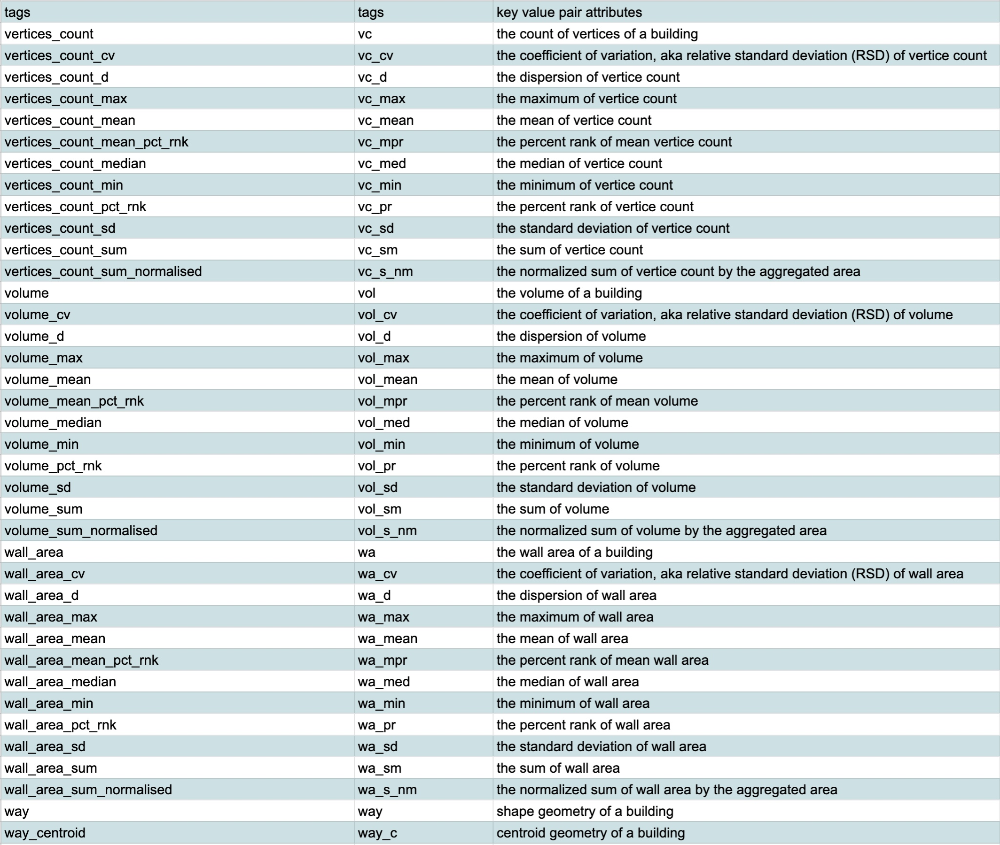

## Global Building Morphology Indicators (GBMI)

### Sypnosis

This aim of this project/research is to generate a Global Building Morphology Indicators (GBMI)
dataset based on the open data - OpenStreetMap. A collection of bash scripts and SQL scripts are run
to perform the database setup, data ingestion, data transformation and analysis that yields the GBMI
output, and the final data export.

The scope of GBMI datasets could be global, extracting building data from the `planet`
Openstreetmap data; or it could be focused on a selection of geographical regions such of countries,
states, or cities. Each defined scope will be contained in its own database. The raster system is
also something that could be defined and swapped as it fits the research purpose.

The GBMI requires a PostgreSQL 12 (or newer) database running on cloud services such as Amazon Web
Services (AWS) RDS or self-managed server. PostGIS and a few other extensions are also necessary for
our spatial analysis. These extensions are: postgis, hstore, fuzzystrmatch, postgis_tiger_geocoder,
postgis_topology.

### About this Python Package

The GBMI dataset generation process generate more than 50 tables per country per raster system. The
number of tables increases when more than one raster system is implemented. Keeping analysis 
pipeline consistent across selected geographical scopes, many parts of the scripts are repetitive. For ease
of maintenance, this repository offers a framework that generates these bash scripts and SQL queries
using templates.

The python package is developed using Jinja2 templating engine to produce bash scripts and sql
queries using predefined templates. The scripts are then executed for each of the pre-defined
geographical scope of studies. The package aim to achieve the following goals:

- enforce re-usable script as much as possible
- maintain consistency of analysis across all databases (each of which represents geographical
  scope)
- manage/apply/adopt changes with ease across all databases

The package consists of these modules:

- configurations.py: this modules reads and validates the `config.json` file
- core.py: this module consists of the `QueryParamExpander` and `QueryGenerator` classes. The
  `QueryParamExpander` expands parameters defined in `config.json` for all combination of database,
  rasters and aggregation levels; whereas the `QueryGenerator` calls the Jinja2 template engine API
  to generate all the bash scripts and query scripts
- logging.py: this module consists of a `logging` class that logs and feedback on the running/output
  status of the python package in generating those scripts

We run the package by `python main.py`. The generation of all queries and scripts takes more 
than 5 mins. To speed up the process or updates and/or bug fixes in specific sections, the 
`python main.py` command also takes one or more section key arguments (namely `a-db-setup` 
`b-osm-rasters-gadm` `c0-misc` `c1-gbmi` and/or `d-export`). This way, we could selectively 
generate 
scripts and queries for one or more specific sections. 

#### Configuring the `config.json`

The python package relies on the configurations in the `config.json` to expand and generate bash
scripts and sql query scripts for respective database, targeting corresponding raster systems and
aggregated levels.

The following are the highlights of key configurations:

`template_dirname`: the directory name where template is store, relative to root of the package

`output_dirname`: the directory name where scripts are output, relative to root of the package

`parameters` > `common`: these are the commonly shared database/server instance related properties:

- `host_address`: database host address
- `db_script_dir`: directory path where db setup queries are stored
- `public_schema`: public schema name
- `public_script_dir`: directory path where queries for generating tables in public queries are
  stored
  (generally GADM and raster related)
- `misc_schema`: schema name for miscellaneous tables
- `misc_script_dir`: directory path where queries for generating tables in miscellaneous schema are
  stored
- `gbmi_schema`: schema name for gmbi tables
- `gbmi_script_dir`: directory path where queries for generating tables in gbmi schema are stored
- `qa_schema`: schema name for quality analysis related tables
- `qa_script_dir`: directory path where queries for generating tables in quality analysis schema
- `base_source_dir`: base directory path where base source such as GADM and country codes are stored
- `site_source_dir`: base directory path where gbmi source data are stored. Currently, each
  geographical scope has its own sub-directory that contains the source OSM and rasters
- `country_codes_dir`: directory name where country codes csv is stored
- `country_codes_file`: file name of the country code files
- `gadm_source_dir`: directory name where gadm source files are stored
- `gadm_source_file`: source file name of the gadm shapefile
- `gadm_target_table`: target table when loading gadm shapefile
- `export_base_dir`: base directory path when exporting gbmi databases/tables
- `export_script_dir`: directory path where export query templates are stored

`parameters` > `a-db-setup`: these are parameters that are expanded to generate database set up
scripts for each database respectively

- `databases`: an array of database to be created/setup
- `users`: an array of users/roles to be created, who are granted connect and read permissions to
  databases, schemas, tables and views
- `superusers`: an array of superusers to be created, who will be granted superuser privileges to
  create/drop databases, schemas, tables and views.

`parameters` > `b-osm-rasters-gadm`: these are parameters that are expanded for each database to
generate scripts that load osm, gadm and rasters, and queries that generate subsequent related
tables

- `osm_source_files`: an array of osm source files and its corresponding database
- `raster_names`: an array of raster names and corresponding file suffix. The
  `raster_population` is optional, as it is only available with `World Population` rasters.
- `agg_levels`: an array of aggregation levels for merging the GADM areas and geoms

`parameters` > `c0-misc`: these are parameters that are expanded to generate queries in
miscellaneous schema, which is a pre-requisite before running the GBMI scripts

- `databases`: an array of databases
- `raster_names`: an array of raster names
- `agg_levels`: an array of aggregation levels applied for analyzing building height and levels

`parameters` > `c1-gbmi`: there are the parameters that are expanded to generate bash scripts and
queries for the GBMI pipeline

- `databases`: an array of databases
- `raster_names`: an array of rasters with optional `raster_population` and `limit_buffer` where
  applicable. For our research we apply the buffer limit of 50 to the global study.
- `buffers`: an array of buffers for neighbour computations
- `agg_levels`: an array of aggregation levels

`parameters` > `d-export`: these are the parameters expanded to generate bash scripts and query
templates for GBMI data export

- `databases`: an array of databases
- `raster_names`: an array of rasters with optional `raster_population` and `limit_buffer` where
  applicable.
- `agg_levels`: an array of aggregation levels

### GBMI Process

#### PostgreSQL configurations

Before starting the GBMI process, please configure postgresql credentials in `.pgpass` and/or
`pg_hba.conf` so the scripts can be run without being prompted for password.

The scripts are organized according to the following sections:

- Database setup (a-db-setup)
- OSM loading, global administrative boundaries and raster setup (b-osm-raster-gadm)
- Misc scripts that analyze the building height and levels validity, and building tag value
  frequencies (c0-misc)
- GBMI tables (c1-gbmi)
- GBMI export templates and scripts (d-export)

#### Section a: PostGIS and OpenStreetMap Database Setup

The first step of the GBMI process is to create neccesary databases for each geographical scope, set
up schemas, users and user privileges. The bash scripts and queries under this sections are
generated based on the configurations in the `config.json`.

The bash scripts and queries under this section are to perform the following tasks:

- create a database to host the openstreetmap data and install PostGIS and other necessary
  extensions
- install these extensions: postgis, hstore, fuzzystrmatch, postgis_tiger_geocoder, postgis_topology
- set up necessary schemas as configured in the configuration
- create new users, if specified in the configuration, that set up privileges accordingly

#### Section b: Openstreetmap, Global Administrative Boundaries and Rasters

In this section, the scripts loads the Openstreetmap data, the GADM shapefiles and selected raster
systems from the specified source directory in `config.json`.

##### Openstreetmap

The Openstreetmap data are downloaded from [Geofabrik](http://download.geofabrik.de/) server. If the
scope/area of interest are not directly available, the larger area of the corresponding city/region
is downloaded and further extracted using the [`osmium-tool`](https://osmcode.org/osmium-tool/)
program.

The extracted OSM is then loaded to PostGIS via [`osm2pgsql`](https://osm2pgsql.org/) command.

##### GADM

To map the rasters and osm data to country, province/state, city/town etc more comprehensively, we
use the Global Database of Global Administrative Areas. The GADM data is available in GeoPKG and
Shapefile format. The GADM data can be downloaded from [here](https://gadm.org/index.html).

The shapefile is then loaded to the PostGIS database
via [`shp2pgsql`](https://postgis.net/docs/using_postgis_dbmanagement.html#shp2pgsql_usage) command.

After the GADM shapefile is loaded, we subsequently compute the agggreated area and geometry of the
administrative boundaries at admin level zero (country) through 5.

##### Rasters

In this research, we used the [World Population 2020](https://www.worldpop.org) rasters at two
different resolutions: the 100m and the (aggregated globally) 1km resolutions. The geotiff files for
worldpop could be downloaded from [here](https://www.worldpop.org/geodata/listing?id=29)
and [here](https://www.worldpop.org/geodata/listing?id=64).

Since the worldpop rasters are only available by country, these geotiff files are usually further
extracted using QGIS to extract only the areas of interest.

After that, these rasters are loaded to the corresponding PostGIS database, based on the
configurations in `config.json`,
via [`raster2pgsql`](https://postgis.net/docs/using_raster_dataman.html#RT_Raster_Loader)
command.

The loaded rasters are then vectorized and mapped against the previously loaded GADM to obtain the
country codes, admin division names.

#### Section c0: Miscellaneous

There are also a few tables that are helpful to inspect the quality and state of the OSM building
data before proceeding to the GBMI data. These tables are:

- `osm_polygon_attr_freqs`: this shows the frequency of values of building (osm_polygon) related
  tags. This is a pre-requisite table before started the GBMI pipeline.
- `agg_buildings_height_levels_qa_by_agg_level_raster_name`: this shows aggregated statistics of
  completeness of building height and building levels

#### Section c1: Global Building Morphology Indicators

This section is the bash scripts and queries that create the building morphology indicator tables.
The workflow and steps of computing the indicators are as follows:

_Building Level Indicators_:

- `buildings`: extract mass majority of the buildings from OSM polygon table based on 12 most
  frequent 'building' tag value
- `building_by_raster`: map buildings to each rasters we use in the system so we identify the
  country, province, state and city of the buildings
- `bga_by_raster`: extract the geometric attributes that are needed for calculating the geometric 
  building indicators from `building_by_raster` tables
- `bgi_by_raster`: calculate the geometric building indicators
  from `buidling_geom_attributes_by_rasster` tables
- `bn_by_raster`: extract neighbours for each of the buildings within the maximum buffer of our
  study defined in `config.json`. By definition of neighbours, the neighbour centroid has to 
  fall within the **ring buffer** computed from the centroid of each respective buildings. Then 
  `ST_distance` is used to compute **distance between polygon to polygon**. 
- `bn_by_raster_centroid`: extract neighbours for each of the buildings within the maximum buffer of
  our study defined in `config.json`. By definition of neighbours, the neighbour centroid has to 
  fall within the **ring buffer** computed from the centroid of each respective buildings. Then 
  `ST_distance` is used to compute **distance between centroid to centroid**. 
- `bn_buffer_by_raster`: calculate the neighbour indicators for each building within 3 different
  buffers: 25, 50 and 100, using `bn_by_raster` table.
- `bn_buffer_by_raster_centroid`: calculate the neighbour indicators for each building within 3
  different buffers: 25, 50 and 100, using `bn_by_raster_centroid` table.
- `bni_by_raster`: joint table of the `bn_buffer_by_raster` at 3 different buffers
- `bni_by_raster_centroid`: joint table of the `bn_buffer_by_raster_centroid` at 3 different buffers
- `buildings_indicators_by_raster`: joint table of `bgi_by_raster` and `bni_by_raster`
- `buildings_indicators_by_raster_centroid`: joint table of `bgi_by_raster` and
  `bni_by_raster_centroid`.

_Aggregated Building Indicators_:

The building indicators are aggregated at 5 GADM levels and at raster cell levels. Thus the
aggregation levels are namely:

- raster cell
- country
- province or state (admin division 1)
- county or district (admin division 2)
- town or city (admin division 3)
- urban commune or municipals (admin division 4)
- admin division 5

Three types of aggregated tables will be generated:

- `agg_bgi_by_agg_level_by_raster`: this is aggregation of the geometric building indicators
  from `bgi_by_raster` tables
- `agg_bni_agg_level_by_raster`: these tables combined the aggregation of the geometric building
  indicators and building neighbour indicators from
  `bni_by_raster_name` tables
- `agg_bni_agg_level_by_raster_centroid`: these tables combined the aggregation of the geometric
  building indicators and building neighbour indicators from
  `bni_by_raster_name_centroid` tables

#### Section d: Exporting the Global Building Morphology Indicators

With the configuration in `config.json` of the target scope/datasets to be exported, the python
script also generates a list of bash scripts, one for each dataset, to export the GBMI indicators.
The current export process supports ESRI Shapefiles `shp`, GeoPackage `gpkg`, Comma Separated
Values `csv`.

The exported files are organized under the following directory hierarchic structure:

- {city}
    - {aggregation-level}
        - agg_bgi_by_{agg_level}_{raster_name}
        - agg_bni_by_{agg_level}_{raster_name}
        - agg_bni_by_{agg_level}_{raster_name}_centroid
    - bldg
        - buildings_indicators_{raster_name}
        - buildings_indicators_{raster_name}_centroid

The export of various format are stored under the `{aggregation-level}` folder.

### Computed Global Building Morpological Index

The computed GBMI is a dataset with more than 380 fields. THe export functions also mandate
abbreviated fieldnames. Thus, the following is the data dictionary for all the exported fields.

